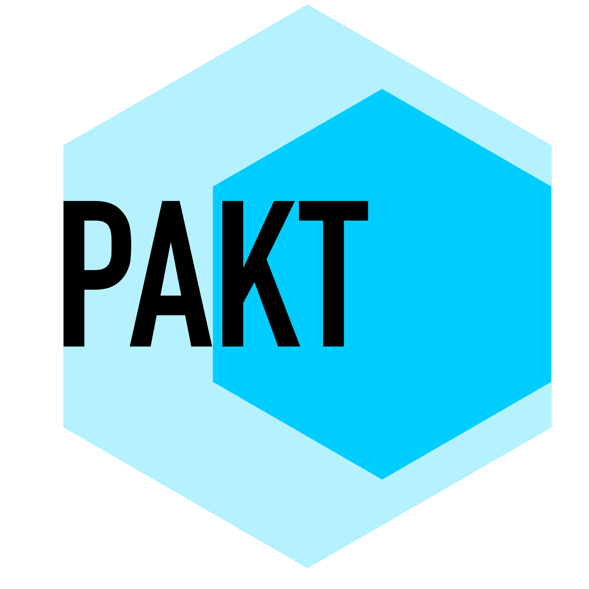

<h1 align="center">
   
  
   
</h1>

<h4 align="center">Contract first, typescript first Open API generators for node servers</h4>

## About

PAKT allows you to convert Api contracts in OpenAPI 3+ into Api implementations for your web framework (starting with https://koajs.com/).

## Key Features

- OpenAPI 3+ support
- Zod support for schema validation
